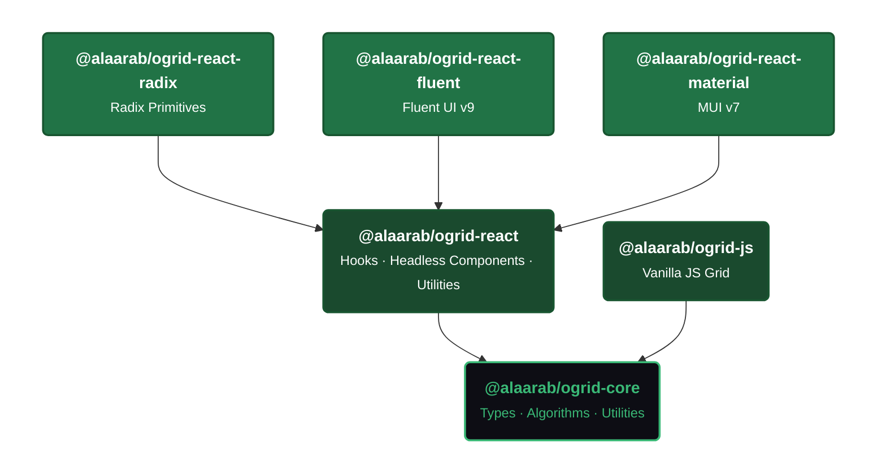

# Overview

OGrid is a lightweight, open-source data grid library that delivers spreadsheet-grade features without the enterprise paywall. It ships with three React UI implementations -- Radix, Fluent UI, and Material UI -- plus a vanilla JS package, all powered by a shared TypeScript core.

## Why OGrid?

Most production-grade React data grids fall into one of two camps: free but limited, or feature-rich but locked behind expensive licenses. OGrid bridges that gap.

- **Free and MIT-licensed.** Every feature is included. No enterprise tier, no feature gating.
- **20+ built-in features.** Sorting, filtering, pagination, cell editing, clipboard, undo/redo, fill handle, row selection, cell range selection, column pinning, column groups, CSV export, context menu, keyboard navigation, status bar, and more.
- **Three UI frameworks.** Pick the one that matches your design system -- or switch later with zero logic changes.
- **TypeScript-first.** Full strict-mode TypeScript with exported types for every prop, event, and API method.
- **Lightweight.** The Radix package has no heavy framework dependency. Fluent and Material packages use their respective component libraries as peer dependencies.

## Architecture

OGrid is built on a **3-layer architecture**: a pure TypeScript core, a React hooks layer, and thin UI shells. No duplicated logic, no drift.

### Core Layer — `@alaarab/ogrid-core`

Pure TypeScript with zero dependencies. Provides the type system (`IOGridProps`, `IColumnDef`, `IOGridApi`, `FilterValue`, etc.) and shared algorithms (`getCellValue`, `buildHeaderRows`, `parseValue`, `normalizeSelectionRange`, etc.) used by both the React and JS packages.

### React Layer — `@alaarab/ogrid-react`

All state management and business logic as React hooks:

| Domain | Hooks |
|---|---|
| **Orchestration** | `useOGrid` · `useDataGridState` |
| **Cell Editing** | `useCellEditing` · `useInlineCellEditorState` · `useRichSelectState` |
| **Selection** | `useCellSelection` · `useRowSelection` · `useActiveCell` |
| **Navigation** | `useKeyboardNavigation` (arrow keys, Tab, Enter, Ctrl+Arrow) |
| **Clipboard** | `useClipboard` · `useFillHandle` · `useUndoRedo` |
| **Layout** | `useColumnResize` · `useSideBarState` · `useColumnChooserState` |
| **Filtering** | `useColumnHeaderFilterState` · `useFilterOptions` |

Plus headless components (`OGridLayout`, `StatusBar`, `SideBar`, `GridContextMenu`) and utilities (`exportToCsv`, `computeAggregations`, `processClientSideData`).

### UI Layer — Pick Your Framework

Each UI package is a thin shell that calls the same core hooks and renders results into native components:

| Package | Built on | Best for |
|---|---|---|
| `@alaarab/ogrid-react-radix` | Radix primitives | Lightweight apps, custom design systems |
| `@alaarab/ogrid-react-fluent` | Fluent UI v9 | Microsoft 365, SharePoint, Teams apps |
| `@alaarab/ogrid-react-material` | MUI v7 | Material Design apps, dashboards |

All three export the same `OGrid` component with the same props. All three pass the same 92 integration tests. Switching frameworks is a one-line import change — your column definitions, event handlers, data sources, and API calls stay identical.

### Why This Matters

- **Write once, render anywhere.** A bug fix or feature in core lands across all three frameworks instantly.
- **Zero lock-in.** Migrate between frameworks without rewriting business logic.
- **Guaranteed parity.** Shared test factories ensure all three packages behave identically.
- **Small surface area.** No duplicated state logic to drift out of sync.

## Packages

| Package | npm | Description |
|---|---|---|
| `@alaarab/ogrid-core` |  | Pure TS types, algorithms, utilities (zero deps) |
| `@alaarab/ogrid-react` |  | React hooks, headless components, utilities |
| `@alaarab/ogrid-react-radix` |  | Radix UI implementation (default, lightweight) |
| `@alaarab/ogrid-react-fluent` |  | Fluent UI v9 implementation |
| `@alaarab/ogrid-react-material` |  | Material UI v7 implementation |
| `@alaarab/ogrid-js` |  | Vanilla JS data grid (no framework) |

## Feature Highlights

| Feature | Description |
|---|---|
| Sorting | Single-column sort with ascending/descending toggle |
| Filtering | Text, multi-select, and people filters per column |
| Pagination | Client-side or server-side with configurable page sizes |
| Cell Editing | Inline text, select, checkbox, and rich select editors |
| Cell Selection | Spreadsheet-style range selection with drag support |
| Clipboard | Copy/paste with multi-cell support (Ctrl+C / Ctrl+V) |
| Fill Handle | Drag to fill cells (like Excel) |
| Undo/Redo | Full undo/redo stack for cell edits |
| Row Selection | Single or multiple row selection with checkbox column |
| Column Pinning | Pin columns to left or right edge |
| Column Groups | Multi-row grouped column headers |
| Column Chooser | Show/hide columns with a dropdown |
| Context Menu | Right-click menu with copy, paste, undo, and export |
| CSV Export | One-click export to CSV |
| Keyboard Navigation | Arrow keys, Tab, Enter, Escape for full keyboard control |
| Status Bar | Row count, filtered count, selected count, and aggregations |
| Server-Side Data | `IDataSource` interface for server-side pagination and filtering |
| Grid API | Imperative `IOGridApi` ref for programmatic control |
| Column Resize | Drag column borders to resize |
| Theming | Inherits your framework's theme automatically |

## Coming from AG Grid?

OGrid is designed as a drop-in replacement for AG Grid with a simpler, more React-idiomatic API. If you are migrating from AG Grid, see the [Migration Guide](../guides/migration-from-ag-grid).

## Next Steps

- [Installation](./installation) -- install OGrid for your framework
- [Quick Start](./quick-start) -- build a grid with Radix, Fluent UI, or Material UI
